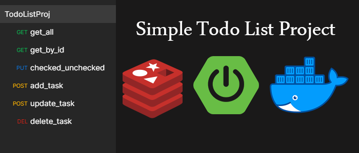

# spring-boot-redis-todolist
Simple todolist project with SpringBoot and Redis

### Start the Application with the help of Docker
Go to the project directory and execute the following command in the terminal

`docker-compose up`
  
And we are done, the SpringBoot App will be starting on port 8080 and Redis is on 6379

### Requirements To Run Application Without Docker
  - JDK 17
  - Redis
  
### For just run Redis using docker
  - `docker run -p 6379:6379 redis`
  
### Api
- get list tasks
`GET: http://localhost:8080/tasks`
- get task data
`GET: http://localhost:8080/task/{id}`
- add new/update task
`POST: http://localhost:8080/task`
- delete one task
`DELETE: http://localhost:8080/task/{id}`
- ckecked and unchecked task
`PUT: http://localhost:8080/task/checked/{id}`

### Dependencies And Tools Used To Build Application
  - Git
  - Spring Boot 3
  - starter-data-redis
  - starter-web
  - lombok
  - PostMan
